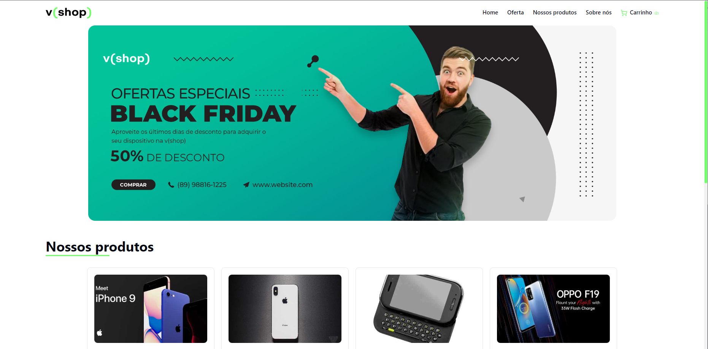

# 💚 v(shop)

A VShop é uma aplicação web para e-commerce especializada em produtos eletrônicos. Navegue por uma ampla seleção de gadgets e dispositivos de última geração, tudo isso com facilidade e conveniência online.

<p align= "center">
  
</p>

# 💻 Techs and challenges 
- Projeto desenvolvido em React + TypeScript, utilizando o framework de construção Vite para otimizar o desenvolvimento.
- Utilizei Shadcn UI como lib de UI, tornando a interface da aplicação mais intuitiva e moderna para o usuário.
- Desenvolvimento de Contexts para tornar o compartilhamentos dos dados do carrinho de compras mais eficiente entre os componentes.
- Persistência de dados em localStorage para permitir que os dados sejam armazenados quando o usuário sai da página.
- Enfrentei desafios para utilizar o react-router-dom em conjunto com os contexts, lidando com alguns erros.
- Meu primeiro contato com o tailwind, a todo instante era necessário consultar a documentação para procurar as equivalências.

# 💡 Features
- Adicionar produtos a um carrinho
- Visualizar detalhes do produto em um hover card (mouse em cima)
- Menu de navegação do carrinho
- Excluir produtos do carrinho 
- Confirmar compra (checkout para o whatsapp👀)
- Modo claro e escuro

# 🚀 Features futuras
- Responsividade
- Criação de novas páginas
- Novas sections
- Integrar NavBar

# ✅ Acesse o v(shop) aqui e aproveite a experiência

https://vshop-flax.vercel.app/

# ⚙️ Abra e rode o projeto
Clone o repositório
```
https://github.com/ericlbarreto/vshop.git
```
Instale as dependências
```
npm install
```
Rode o projeto
```
npm run dev
```
Abra o link
```
http://localhost:5173/
```
